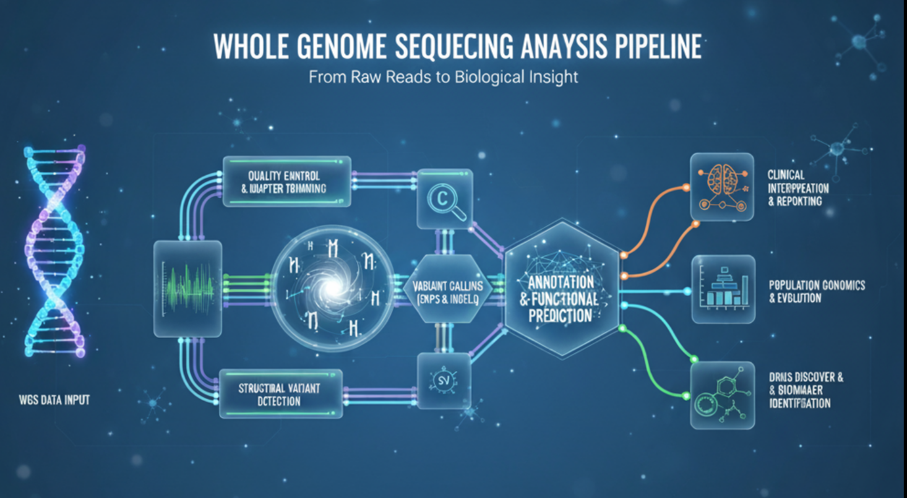

# WGS Analysis Pipeline



[](https://github.com/steven0seagal/WGS_analysis/actions/workflows/ci.yml)
[](https://opensource.org/licenses/MIT)
[](https://snakemake.github.io)
[](https://docs.conda.io/en/latest/)
[](https://www.docker.com/)
[](https://www.python.org/downloads/)

A comprehensive repository for Whole Genome Sequencing (WGS) germline variant analysis pipelines using GATK and DeepVariant.

## Overview

This repository provides end-to-end pipelines for germline variant discovery from WGS data, implementing both the established GATK Best Practices and the modern DeepVariant approach. The pipelines are available in both Bash scripts for conceptual clarity and Snakemake workflows for production-scale reproducibility and scalability.

## Table of Contents

- [Features](#features)
- [Quick Start](#quick-start)
- [Pipeline Components](#pipeline-components)
- [Directory Structure](#directory-structure)
- [Requirements](#requirements)
- [Documentation](#documentation)
- [Contributing](#contributing)
- [Citation](#citation)
- [License](#license)

## Features

- **Preprocessing**: FASTQ to analysis-ready BAM conversion with BWA alignment, duplicate marking, and base quality score recalibration (BQSR)
- **GATK Pipeline**: HaplotypeCaller with GVCF workflow, joint genotyping, and variant quality score recalibration (VQSR)
- **DeepVariant Pipeline**: Deep learning-based variant calling using convolutional neural networks
- **Functional Annotation**: Variant annotation with SnpEff and Ensembl VEP
- **Workflow Management**: Snakemake for scalable, reproducible execution
- **Containerization**: Docker support for DeepVariant

## Quick Start

### 1. Environment Setup

Create the conda environment:

```bash
conda env create -f environment.yml
conda activate wgs_analysis
```

### 2. Prepare Reference Genome

```bash
./scripts/prepare_reference.sh /path/to/reference.fasta
```

### 3. Preprocess FASTQ to BAM

```bash
./scripts/preprocess_fastq_to_bam.sh Sample1 sample1_R1.fastq.gz sample1_R2.fastq.gz reference.fasta dbsnp.vcf.gz
```

### 4. Run GATK Pipeline

Using the convenience script:

```bash
./run_gatk.sh [num_cores]
```

Or manually using Snakemake:

```bash
cd workflows/gatk
# Edit config.yaml with your paths
snakemake -j <num_cores>
```

Or using Bash script:

```bash
# Create a config file with required variables
./workflows/gatk/gatk_pipeline.sh config.sh
```

### 5. Run DeepVariant Pipeline

Using the convenience script:

```bash
./run_deepvariant.sh Sample1 /path/to/inputs /path/to/outputs /path/to/ref.fasta /path/to/sample.bam
```

Or manually:

```bash
cd workflows/deepvariant
# Edit config.yaml
snakemake -j <num_cores>
```

## Pipeline Components

### Preprocessing Pipeline
- Read alignment with BWA-MEM
- Coordinate sorting and BAM conversion
- PCR duplicate marking with GATK MarkDuplicates
- Base quality score recalibration (BQSR)

### GATK Germline Pipeline
- Per-sample GVCF generation with HaplotypeCaller
- Joint genotyping across samples
- Variant quality score recalibration (VQSR) for SNPs and indels
- Functional annotation with SnpEff and VEP

### DeepVariant Pipeline
- Deep learning-based variant calling
- Supports multiple sequencing types (WGS, WES, PacBio)
- Containerized execution with Docker

## Directory Structure

```
.
├── environment.yml              # Conda environment definition
├── scripts/                     # Utility scripts
│   ├── prepare_reference.sh     # Reference genome indexing
│   └── preprocess_fastq_to_bam.sh # FASTQ to BAM preprocessing
├── workflows/                   # Pipeline workflows
│   ├── gatk/                    # GATK pipeline
│   │   ├── Snakefile            # Snakemake workflow
│   │   ├── config.yaml          # Configuration
│   │   └── envs/                # Conda environments
│   └── deepvariant/             # DeepVariant pipeline
│       ├── Snakefile
│       └── config.yaml
├── docs/                        # Documentation
├── LICENSE
└── README.md
```

## Requirements

- Conda/Mamba for environment management
- Docker for DeepVariant (optional, for GPU acceleration)
- Reference genome (e.g., GRCh38)
- Known variant sites (dbSNP, HapMap, etc.) for GATK
- Sufficient storage and compute resources

## Documentation

- [Setup Guide](docs/setup.md) - Detailed setup instructions
- [Pipeline Descriptions](docs/pipelines.md) - In-depth pipeline explanations
- [Examples](docs/examples.md) - Complete workflow examples
- [Troubleshooting](docs/troubleshooting.md) - Common issues and solutions

## Support

- 📖 [Documentation](docs/)
- 🐛 [Report Issues](https://github.com/steven0seagal/WGS_analysis/issues)
- 💬 [Discussions](https://github.com/steven0seagal/WGS_analysis/discussions)

## Contributing

We welcome contributions! Please see our [Contributing Guide](CONTRIBUTING.md) for details on how to get started. We also adhere to our [Code of Conduct](CODE_OF_CONDUCT.md).

## Citation

If you use this pipeline in your research, please cite:

```
@misc{wgs_analysis_pipeline,
  title={WGS Analysis Pipeline: Comprehensive Germline Variant Analysis with GATK and DeepVariant},
  author={Your Name},
  year={2025},
  howpublished={\url{https://github.com/yourusername/WGS_analysis}}
}
```

Additionally, please cite the underlying tools:
- GATK: McKenna et al., 2010
- DeepVariant: Poplin et al., 2018
- SnpEff: Cingolani et al., 2012
- VEP: McLaren et al., 2016

## License

This project is licensed under the MIT License - see the [LICENSE](LICENSE) file for details.
